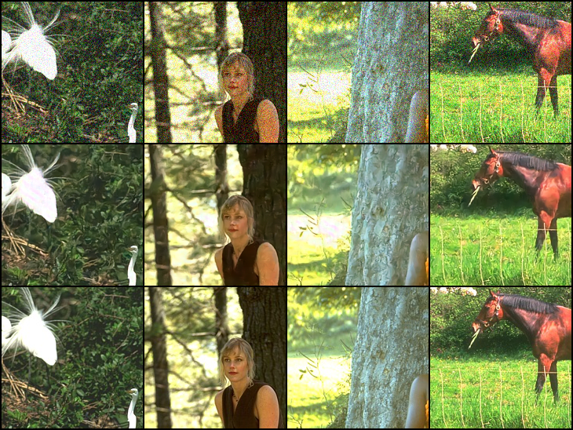
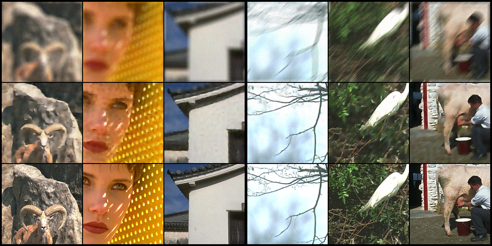
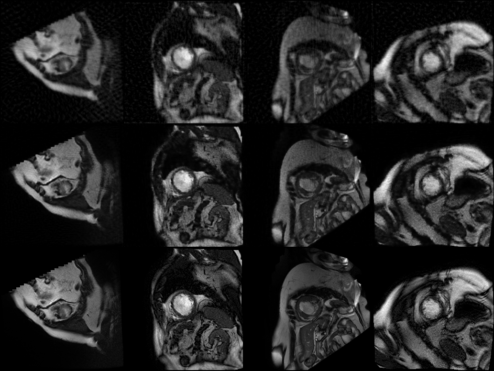

# ECE239AS-Final-Project-Prox-Grad-Net
Repository of the final project of ECE239AS: Computational Imaging

By Che-Hsien Lin, Neng Wang

In this final project, We reproduced the work of "Unrolled Optimization with Deep Priors"　<https://arxiv.org/abs/1705.08041> 

We built the 4 following models:

## ODP proximal gradient denoising network
Code in `/denoise`

Trained weights in `/denoise/checkpoint/model.pth`

For train:
Edit the path in train.py and simply run `python train.py`

For test:
The script generates the test result of a randomly chosen mini-batch of images from the input directory.
If the batchsize is 1, there will be no random crop in testing. Batchsize can be edited in test.py.
Test result will be saved in test.py, and the PSNR will be printed.

`python test.py --model /checkpoint/model.pth --input $your path to the directory containing test images$`

## ODP proximal gradient deblurring network (disk & motion)
Code in `/deblur_disk` & `/deblur_motion`

Trained weights in `/deblur_disk/checkpoint/model.pth` & `/deblur_motion/checkpoint/model.pth`

For train:
Edit the path in train.py and simply run `python train.py`

For test:
The script generates the test result of a randomly chosen mini-batch of images from the input directory. 
Batchsize can be edited in test.py. Test result will be saved in test.py, and the PSNR will be printed.

`python test.py --model /checkpoint/model.pth --input $your path to the directory containing test images$`

## ODP proximal gradient CS MRI network
Code in `/cs_mri`

Sampling Patterns in `/cs_mri/data/mask`

We train one model per pattern. 
In order to train on a certain pattern, related code in model.py and dataset.py has to be modified.

